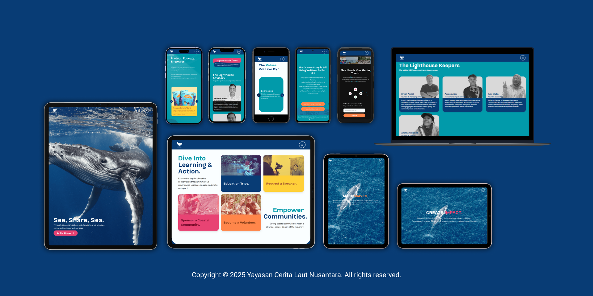

  

    Website yang berfokus pada edukasi dan aksi konservasi laut. &middot; Aplikasi ini dapat diakses <a href="https://narasea.id/">di sini</a>

## Table of contents

- [Table of contents](#table-of-contents)
- [About](#about)
- [Feature](#feature)
- [Screenshot](#screenshot)
- [Prototype](#prototype)
- [Credit](#credit)
- [Link Deploy](#link-deploy)
- [Creator](#creator)

## About

Narasea Indonesia adalah sebuah platform yang bergerak di bidang lingkungan dan berfokus pada edukasi tentang laut beserta ekosistem di dalamnya. Mereka bertujuan untuk meningkatkan kesadaran dan kepedulian masyarakat Indonesia terhadap pelestarian laut dan kehidupannya.

## Feature

- Pengguna dapat melihat informasi Halaman Home (See Our Ocean), Take Action (Raise the Tide) dan About Us (Discover Narasea).
- Pengguna dapat berkomunikasi dengan media sosial narasea.id melalui Instagram, Email dan WhatsApp.
- Pengguna dapat melihat informasi rekening untuk mendonasi kepada Narasea Indonesia.

## Screenshot

## Prototype

- [Figma](https://www.figma.com/design/fRYYIFr689c9KjvW2alAC6/Narasea.id?node-id=0-1&t=458FnaM4acf23FRF-1)

## Credit

- [Tailwind CSS](https://tailwindcss.com/)
- [Laravel](https://laravel.com/)
- [PHP](https://php.net/)
- [Embed Social](https://embedsocial.com/)
- [Font Awesome](https://fontawesome.com/)
- [jQuery](https://jquery.com/)
- [Swiper JS](https://swiperjs.com/)
- [Slick JS](https://kenwheeler.github.io/slick/)
- [Progressive Web Apps](https://web.dev/)

## Link Deploy

- [Narasea Indonesia Official Website](https://narasea.id/)

## Creator

- [Ishak Yesaya](https://github.com/ishakys)
- [Hendra Wijaya Subandi](https://github.com/hendrawijayasubandi)
